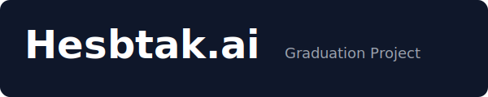
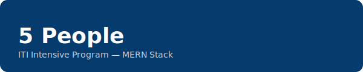

<!--
	README.md — Hesbtak.ai
	A clear, actionable readme for the full project. Replace the SVGs in `/assets/` with polished artwork.
-->

# Hesbtak.ai



Graduation project — ITI Intensive Program for MERN Stack



Short description
-----------------

Hesbtak.ai is a multi-tenant SMB ERP and accounting platform built as a graduation project for the ITI Intensive Program (MERN Stack). The solution combines a React + Vite frontend, a NestJS backend, Prisma for database access, and PostgreSQL to provide tenant-isolated accounting features, forecasting, and an assistant module.

Status
------

- Core backend endpoints: registration, authentication (JWT + tenant context), tenant provisioning, chart of accounts, invoices, journal entries, payments, and forecasting.
- Frontend: Vite/TanStack-based UI with tenant onboarding flows and dashboards.
- AI/assistant helpers and a lightweight deterministic forecasting engine (tenant-scoped, explainable formulas).

High-level architecture
-----------------------

- Front/: React + Vite frontend (client)
- Back/: NestJS backend (REST API under `/api/v1`)
- AI/: Prompt assets and services used for assistant features
- Prisma: schema and migrations under `prisma/` (DB client code used by both Back and AI where relevant)
- Database: PostgreSQL with a shared public schema and one schema per tenant for accounting data

Project layout
--------------

- `Front/` — web app (Vite, React, route tree, components)
- `Back/` — API server (NestJS, modules, middleware, guards)
- `AI/` — utilities, prompts, and services used for assistant features inside the project
- `prisma/` — shared Prisma schema and migrations (for the whole monorepo where applicable)
- `uploads/` — file uploads used by the frontend/back

Tech stack
----------

- Frontend: React, Vite, TypeScript
- Backend: Node.js, NestJS, TypeScript
- ORM: Prisma
- Database: PostgreSQL
- Dev tooling: ESLint, Jest (for e2e), Docker-compose ready configs

Key features
------------

- Multi-tenant provisioning with isolated tenant schemas
- Authentication and role/membership checks
- Onboarding and starter chart-of-accounts provisioning
- Invoices, bills, payments, journal entries, and reports
- Explainable deterministic forecasting engine (no cross-tenant ML)
- Assistant/AI prompts for user-facing helper flows

Getting started (local)
-----------------------

Prerequisites:

- Node 18+ (recommended)
- pnpm or npm
- PostgreSQL
- Docker (optional for local DB)

Quickstart (development):

```bash
# Backend
cd Back
npm install
npx prisma generate
npx prisma migrate deploy
npm run start:dev

# Frontend (in a separate terminal)
cd Front
npm install
npm run dev
```

See [STARTUP_AND_ENV.md](./STARTUP_AND_ENV.md) for environment variables, database connection strings, and detailed setup.

Database and migrations
-----------------------

- Prisma schema and migration history live under `prisma/` in each service (Back/ and AI/ as applicable).
- Use `npx prisma migrate dev` for iterative development or `npx prisma migrate deploy` for CI/prod flows.

Running tests
-------------

- End-to-end tests are configured under `test/` (see `app.e2e-spec.ts` files). Use the projects' `jest-e2e.json` and `npm run test:e2e` if provided in the service `package.json`.

Deployment notes
----------------

- Dockerfile and `docker-compose.yml` are present for local containerized runs.
- Ensure production env disables dev flags, runs `prisma migrate deploy`, and sets secure secrets for JWT and DB.

Contributing
------------

If you'd like to contribute or review code:

1. Fork the repo and create a feature branch.
2. Run linters and tests locally.
3. Open a PR describing the change and the testing steps.

Team
----

This project was implemented by the team: **5 People** — a graduating group from the ITI Intensive Program for MERN Stack.

Acknowledgements
----------------

- This repository and the project are the graduation submission for the ITI Intensive Program (MERN Stack). Replace the SVGs in `/assets/` with your preferred logos and artwork.

Contact
-------

For questions about running or extending the project, open an issue or contact the team lead listed in project management materials.

License
-------

This repository does not include a specific license file. Add a `LICENSE` file if you want to publish under an open license.

Assets
------

- Placeholder logos are in `assets/logo.svg` and `assets/team-logo.svg`. Replace them with high-resolution artwork for release.

