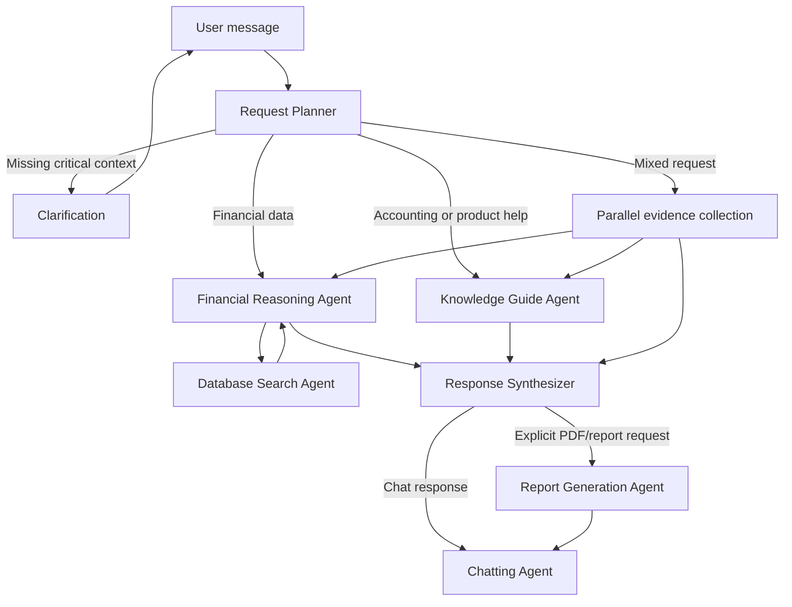

# Hesbetak AI Chatbot Architecture V2

Status: Implemented baseline

## Implementation Status

Implemented on June 12, 2026:

- Replaced `ragSearchAgent` and transaction embeddings with typed financial database evidence requests.
- Added bounded financial reasoning iterations and conditional PDF report routing.
- Added the global two-corpus knowledge table, PostgreSQL lexical search, vector search, and RRF fusion.
- Added the accounting workbook extraction pipeline and generated page/table-aware chunks.
- Added the bilingual frontend product guide and route links.
- Added clarification, citations, evidence identifiers, and mixed-source response synthesis.
- Added assistant UI rendering for sources, routes, and report attachments.
- Applied the knowledge migration and loaded both corpora in the configured database.

The checked-in local environment uses deterministic mock vectors so development and
tests are repeatable. Production Qwen vectors require a dedicated
`Qwen/Qwen3-Embedding-8B` Text Embeddings Inference endpoint:

```env
AI_EMBEDDING_PROVIDER=tei
AI_EMBEDDING_BASE_URL=https://your-qwen-tei-endpoint
AI_EMBEDDING_API_KEY=...
AI_EMBEDDING_DIMENSIONS=2000
```

Run `npm run knowledge:ingest` after changing providers to replace existing
vectors with Qwen embeddings.

## 1. Objective

Replace the current transaction-oriented RAG workflow with two separate, purpose-built capabilities:

1. **Financial data reasoning**
   - The financial reasoning agent decides what database evidence it needs.
   - It sends typed data requests to the database search agent.
   - The database search agent generates, validates, and executes read-only SQL.
   - The financial reasoning agent evaluates the returned evidence and may request more data.
   - A PDF report is generated only when the user explicitly requests a report or PDF.

2. **Knowledge assistance**
   - Answer accounting questions from the Financial Accounting Workbook.
   - Help users navigate and operate Hesbetak from a versioned frontend knowledge document.
   - Combine accounting guidance, product guidance, and live financial data when a question needs more than one source.

The old `ragSearchAgent` and transaction-embedding pipeline will be removed from the chatbot workflow.

## 2. Problems in the Current Design

The current implementation has several responsibilities mixed together:

- `financialReasoningAgent` performs a fixed set of vector searches before it knows what evidence the question requires.
- Operational records such as invoices, journal entries, payments, and accounts are copied into embeddings even though they can be queried precisely with SQL.
- `ragSearchAgent` retrieves semantically similar transaction text, which can return plausible but numerically incomplete evidence.
- The financial reasoning path always enters `reportGenerationAgent`, including ordinary chat answers.
- The database agent contains a manually maintained partial schema description that can drift from the real tenant schema.
- The database agent both retrieves data and writes the final answer, which makes multi-query financial reasoning difficult.
- A large financial context snapshot is prepared for every conversation even when the question does not need it.
- Retrieval is vector-only and has no lexical path for account names, invoice numbers, accounting terms, routes, or exact UI labels.

Financial records should remain structured data. RAG should be reserved for unstructured knowledge.

## 3. Design Principles

- Use SQL for tenant financial facts and calculations.
- Use hybrid retrieval for accounting and product documentation.
- Never let retrieved text override database evidence for balances or transaction values.
- Use typed JSON contracts between agents instead of passing unrestricted natural-language prompts.
- Keep tenant data isolated at every database boundary.
- Attach provenance to database evidence, workbook excerpts, and frontend routes.
- Ask one focused clarification question when required information cannot be inferred safely.
- Generate reports conditionally, not as a mandatory graph step.
- Generate dynamic prompt context from versioned catalogs rather than maintaining large static prompts.

## 4. Target Agent Graph



### Recommended agent set

1. **Request Planner**
   - Identifies the user's goals, required evidence sources, date range, entities, and output format.
   - Splits compound requests into sub-tasks.
   - Decides whether clarification is necessary.

2. **Financial Reasoning Agent**
   - Plans the financial analysis.
   - Creates one or more structured database requests.
   - Reviews returned query evidence.
   - Iterates when more evidence is required, up to a configured limit.
   - Produces findings, calculations, limitations, and confidence.

3. **Database Search Agent**
   - Converts a structured data request into SQL.
   - Validates tenant isolation and read-only behavior.
   - Executes the query and returns structured evidence.
   - Does not compose the final user answer.

4. **Knowledge Guide Agent**
   - Optimizes queries for the accounting and product corpora.
   - Runs hybrid retrieval and optional reranking.
   - Produces grounded guidance with page citations and application links.

5. **Response Synthesizer**
   - Combines financial, accounting, and product evidence.
   - Preserves source distinctions and uncertainty.
   - Selects chat or report output according to the planner's explicit output mode.

`QueryExpansion` should initially be a deterministic/LLM-assisted step inside the Knowledge Guide Agent, not another independent agent. It can be separated later if evaluation shows a need.

## 5. Agent Contracts

Natural-language reasoning may be included for model context, but agent communication should use validated structures.

### Request plan

```ts
type RequestPlan = {
  intent:
    | "financial_data"
    | "accounting_knowledge"
    | "product_help"
    | "mixed"
    | "general";
  goals: string[];
  outputMode: "chat" | "pdf_report";
  dateRange?: {
    from?: string;
    to?: string;
    preset?: string;
  };
  entities?: Array<{
    type: "account" | "customer" | "vendor" | "invoice" | "journal" | "other";
    value: string;
  }>;
  knowledgeCorpora: Array<"accounting_workbook" | "product_guide">;
  requiresClarification: boolean;
  clarificationQuestion?: string;
};
```

### Financial data request

The reasoning agent should not merely say, "find sales." It should state the evidence shape it needs.

```ts
type FinancialDataRequest = {
  requestId: string;
  objective: string;
  businessQuestion: string;
  metrics: string[];
  dimensions: string[];
  filters: Array<{
    field: string;
    operator: "eq" | "in" | "contains" | "gte" | "lte" | "between";
    value: unknown;
  }>;
  dateRange?: {
    from?: string;
    to?: string;
  };
  expectedColumns: string[];
  preferredGranularity?: "transaction" | "daily" | "monthly" | "quarterly" | "summary";
  maxRows: number;
  reason: string;
};
```

### Database evidence

```ts
type QueryEvidence = {
  requestId: string;
  status: "success" | "empty" | "rejected" | "error";
  sql?: string;
  columns: string[];
  rows: Record<string, unknown>[];
  rowCount: number;
  truncation?: {
    applied: boolean;
    limit: number;
  };
  assumptions: string[];
  warnings: string[];
  executionMs?: number;
};
```

### Analysis result

```ts
type AnalysisResult = {
  findings: Array<{
    statement: string;
    evidenceRequestIds: string[];
    confidence: "high" | "medium" | "low";
  }>;
  calculations: Array<{
    label: string;
    formula: string;
    value: number | string;
    evidenceRequestIds: string[];
  }>;
  limitations: string[];
  needsMoreData: boolean;
  nextDataRequests: FinancialDataRequest[];
};
```

The graph should enforce a maximum of three database iterations and a total query limit per message. When the limit is reached, the answer must disclose the missing evidence.

## 6. Database Search Redesign

### Schema awareness

Replace the handwritten schema prompt with a generated, versioned database catalog:

```text
Back/src/modules/ai/database-catalog/
  database-catalog.service.ts
  tenant-schema.catalog.json
  financial-metrics.catalog.json
```

The schema catalog should be generated from migrations or database introspection and contain:

- Tables, columns, data types, nullability, and relationships.
- User-facing aliases such as "sales invoice" and "customer invoice."
- Tenant-safe join paths.
- Sensitive or forbidden columns.
- Supported filters and aggregations.
- Accounting meaning where the raw name is ambiguous.

The metrics catalog should define calculations such as revenue, expenses, receivables, payables, gross profit, cash balance, and aging. This prevents the model from inventing inconsistent formulas.

### Query safety

The database layer must enforce safety independently of the model:

- Use a read-only database role.
- Set the transaction to read-only.
- Set a short `statement_timeout`.
- Allow only `SELECT` and approved common table expressions.
- Parse SQL into an AST instead of relying only on regular expressions.
- Reject cross-schema access, system catalogs, DDL, DML, functions with side effects, and unapproved tables.
- Inject or validate the current organization schema.
- Enforce row and byte limits.
- Parameterize user values.
- Log query fingerprints, execution time, row count, and rejection reason.

`$queryRawUnsafe` should be retired from this path once a parameterized execution adapter is available.

### Responsibility boundary

The database agent returns facts, not conclusions. For a question such as "Why did profit fall?", the reasoning agent may request:

1. Revenue by month and account.
2. Expense totals by month and category.
3. Largest period-over-period changes.
4. Relevant invoices or expenses behind material changes.

It then explains the result using all returned evidence. This is materially more reliable than retrieving semantically similar transaction chunks.

## 7. Knowledge RAG Scope

The new user-facing knowledge store contains exactly two corpora:

1. `accounting_workbook`
2. `product_guide`

The database schema catalog is internal agent context and is not a third user-facing RAG corpus.

### Accounting workbook

The supplied workbook has 105 pages and twelve modules:

1. Introduction to Financial Statements
2. Recording Transactions
3. Adjusting Entries and Closing Entries
4. Cash
5. Receivables
6. Inventory Purchases, Sales, Returns and Discounts
7. Cost of Inventory: FIFO, LIFO, Weighted Average, and Specific Identification
8. Property, Plant and Equipment
9. Liabilities
10. Equity
11. Statement of Cash Flows
12. Ratios and Financial Statement Analysis

The document contains exercises, journal-entry layouts, account lists, formulas, and tables. Page-aware table extraction is therefore mandatory.

### Product guide

Create a version-controlled source:

```text
Back/knowledge/product/frontend-pages.json
```

Each page entry should contain:

```json
{
  "id": "sales.manage-invoices",
  "route": "/sales/invoices",
  "module": "sales",
  "title": {
    "en": "Manage Sales Invoices",
    "ar": "إدارة فواتير المبيعات"
  },
  "aliases": ["customer invoices", "sales bills"],
  "description": "Create, review, edit, and manage customer invoices.",
  "capabilities": [
    "create a manual invoice",
    "upload an invoice for AI extraction",
    "edit an existing invoice",
    "record payment"
  ],
  "prerequisites": ["active organization", "customer and account data"],
  "steps": [],
  "permissions": [],
  "relatedRoutes": ["/sales/customers", "/sales/payments"],
  "keywords": ["invoice", "customer", "payment", "OCR"],
  "sourceVersion": "frontend-route-tree-version"
}
```

Add separate workflow entries for multi-page tasks such as:

- Creating and paying a sales invoice.
- Recording a vendor bill.
- Uploading and reviewing an OCR invoice.
- Creating a journal entry.
- Inviting an organization member.
- Opening and following a support ticket.

The file should be curated, then validated against the generated frontend route tree during CI. Route parsing alone cannot provide accurate prerequisites or user instructions.

## 8. PDF Ingestion

Implement ingestion as a one-time, repeatable offline Python process using `pdfplumber`.

```text
Back/knowledge/ingestion/
  ingest_financial_workbook.py
  extract_pdf.py
  normalize_tables.py
  chunk_document.py
  manifests/
```

### Extraction pipeline

1. Read pages with `pdfplumber`.
2. Preserve page number, module, section, exercise, and nearby heading.
3. Detect and remove repeated headers, footers, and standalone page numbers.
4. Extract tables with line-based and text-based strategies.
5. Convert tables to Markdown while retaining column headers.
6. Associate each table with its heading, instructions, and page.
7. Normalize whitespace, bullets, accounting symbols, and formulas.
8. Use OCR only for pages with insufficient extractable text.
9. Save an intermediate JSON artifact for inspection before embedding.
10. Generate deterministic content hashes so unchanged chunks are not re-embedded.

### Chunking strategy

- Chunk by module, heading, exercise, and semantic block rather than fixed character count.
- Target roughly 300-700 tokens for prose.
- Use a small overlap for prose only.
- Keep a table or journal-entry layout intact when practical.
- Repeat the table title and headers in every split table chunk.
- Store exercises separately from explanatory text.
- Add a short generated context header to otherwise ambiguous table chunks.
- Preserve parent-child relationships so retrieval can expand a matched child into its surrounding exercise or section.

Recommended metadata:

```json
{
  "moduleNumber": 5,
  "moduleTitle": "Receivables",
  "sectionPath": ["Module 5", "Exercise 5-2"],
  "exerciseId": "5-2",
  "pageStart": 37,
  "pageEnd": 38,
  "contentType": "table",
  "language": "en",
  "sourceFile": "financial_accounting_workbook_version_4_point_0.pdf"
}
```

The workbook appears to be exercise-oriented. The assistant must not imply that the document provides an answer key when it does not. It should distinguish retrieved instructions from its own worked explanation.

## 9. Hybrid Retrieval

### Embedding model

Use `Qwen/Qwen3-Embedding-8B` behind a configurable embedding provider.

Do not hardcode the current 1,024-dimensional schema. The selected dimension must match both the provider output and the PostgreSQL index strategy.

Larger vectors are not automatically more accurate in this application. Standard pgvector HNSW indexing has dimension constraints depending on the vector type and extension version. Benchmark these options:

- A Matryoshka-reduced vector such as 1,536 or 2,000 dimensions with `vector`.
- A higher-dimensional representation with `halfvec` when supported.

Choose the smallest dimension that meets the retrieval quality target. Normalize embeddings and use the model's recommended query/document instructions.

### Lexical retrieval correction

PostgreSQL `tsvector` with `ts_rank` or `ts_rank_cd` is ranked full-text search, but it is not true BM25. The recommended first implementation is:

- Dense Qwen vector retrieval.
- PostgreSQL full-text retrieval using a GIN-indexed `tsvector`.
- Reciprocal Rank Fusion (RRF) to combine both rankings.
- Optional Qwen reranker over the top fused candidates.

If evaluation later demonstrates a material need for true BM25, consider `pg_search`/ParadeDB or a dedicated search engine. Adding that infrastructure before measuring the simpler PostgreSQL hybrid would be premature.

### Retrieval sequence

1. Classify target corpus or corpora.
2. Produce up to three concise retrieval queries.
3. Apply metadata filters before or during retrieval.
4. Retrieve the top vector and lexical candidates independently.
5. Fuse with RRF.
6. Rerank the top 20-30 candidates when enabled.
7. Return the top 6-10 diverse chunks.
8. Expand parent context for tables and exercises.
9. Generate an answer with citations.

For mixed questions, retrieve accounting and product evidence independently so product pages do not crowd out accounting content.

## 10. Simplified Knowledge Table

Use one global table instead of creating an embeddings table per tenant:

```sql
CREATE TABLE public.ai_knowledge_chunks (
  id uuid PRIMARY KEY DEFAULT gen_random_uuid(),
  corpus text NOT NULL CHECK (
    corpus IN ('accounting_workbook', 'product_guide')
  ),
  document_id text NOT NULL,
  chunk_id text NOT NULL,
  content text NOT NULL,
  content_tsv tsvector GENERATED ALWAYS AS (
    to_tsvector('english', content)
  ) STORED,
  embedding vector(2000),
  metadata jsonb NOT NULL DEFAULT '{}'::jsonb,
  content_hash text NOT NULL,
  created_at timestamptz NOT NULL DEFAULT now(),
  updated_at timestamptz NOT NULL DEFAULT now(),
  UNIQUE (document_id, chunk_id)
);

CREATE INDEX ai_knowledge_chunks_corpus_idx
  ON public.ai_knowledge_chunks (corpus);

CREATE INDEX ai_knowledge_chunks_fts_idx
  ON public.ai_knowledge_chunks USING gin (content_tsv);

CREATE INDEX ai_knowledge_chunks_embedding_idx
  ON public.ai_knowledge_chunks
  USING hnsw (embedding vector_cosine_ops);
```

The `embedding` type and dimension above are illustrative. The final migration must use the benchmarked dimension and compatible pgvector type.

Arabic product terms need a lexical strategy beyond the English text configuration. Initial options are a normalized multilingual search field with `simple` configuration or separate language-specific generated fields. Dense retrieval remains the main multilingual path.

## 11. Query Optimization and Prompt Context

The Request Planner and Knowledge Guide Agent should receive compact manifests, not entire documents.

### Accounting manifest

Include:

- The twelve module titles.
- Supported content types: explanation, exercise, table, journal layout, formula.
- Retrieval rules for exact accounting terminology and module aliases.

### Product manifest

Include:

- Module names.
- Route names.
- Short capability summaries.
- English and Arabic aliases.

The query optimizer should produce corpus-specific searches. Example:

User:

> My customers owe too much. Why, and where do I record a collection?

Planned work:

- Financial data: receivables balance, customer aging, overdue invoices, recent collections.
- Accounting knowledge: receivables and allowance/collection concepts.
- Product help: customer payments and sales invoice routes.

This produces a personalized answer rather than a generic accounting definition or a list of unrelated transactions.

## 12. Clarification Workflow

Agents may ask the user for more information when the answer would otherwise be materially ambiguous.

Ask a clarification when:

- A comparison has no periods.
- A named customer, vendor, or account matches multiple records.
- "Report" could mean an on-screen explanation or a downloadable PDF.
- The requested accounting treatment depends on missing facts.
- The desired application task is unclear.

Ask only one focused question at a time. Preserve the pending `RequestPlan` in conversation state and resume it after the user answers.

Do not ask for information that can be obtained safely from the database or current organization context.

## 13. Responses, Citations, and Reports

Extend the chatbot response shape:

```ts
type ChatbotResponse = {
  response: string;
  needsClarification?: boolean;
  citations?: Array<{
    type: "workbook" | "product_page" | "database_query";
    label: string;
    page?: number;
    route?: string;
    evidenceRequestId?: string;
  }>;
  links?: Array<{
    label: string;
    route: string;
  }>;
  attachment?: {
    type: "pdf";
    url: string;
    fileName: string;
  };
};
```

Citation examples:

- `Financial Accounting Workbook, Module 5, page 37`
- `Hesbetak: Manage Sales Invoices`
- `Live organization data: query FIN-3`

The report generator runs only when `outputMode === "pdf_report"`. A normal financial explanation goes directly to response synthesis and chat.

## 14. Dynamic Prompt Strategy

Prompts should have three layers:

1. **Stable system policy**
   - Agent responsibility, safety, grounding, and output schema.

2. **Generated application context**
   - Current database catalog version.
   - Financial metric definitions.
   - Accounting and product manifests.

3. **Request evidence**
   - Current user message and conversation state.
   - Database query results.
   - Retrieved knowledge chunks.

This keeps prompts current without hand-editing a large prompt whenever a route or database column changes.

Prompt templates should be versioned and logged by version, not with hidden chain-of-thought. Store structured plans, query requests, evidence references, and final outputs for observability.

## 15. Files to Retire or Rewrite

### Remove from the chatbot path

- `rag-search-agent.ts`
- Transactional source chunking used only by the current RAG workflow.
- `RagIndexService` transaction indexing.
- Per-request fixed vector lookups in `financial-reasoning-agent.ts`.
- Unconditional report edge after financial reasoning.
- Unconditional financial context snapshot generation.
- The `ragSearchAgent` intent and graph state.

### Rewrite

- `financial-reasoning-agent.ts` as an iterative evidence planner and analyzer.
- `database-search-agent.ts` as a read-only evidence service.
- `langgraph.service.ts` with conditional mixed-source and report routing.
- `graph-state.ts` with typed plans, evidence, citations, and clarification state.
- `chatting-agent.ts` or a new response synthesizer to combine grounded evidence.

### Add

```text
Back/src/modules/ai/agents/request-planner-agent.ts
Back/src/modules/ai/agents/knowledge-guide-agent.ts
Back/src/modules/ai/database-catalog/
Back/src/modules/ai/knowledge/
Back/knowledge/product/frontend-pages.json
Back/knowledge/ingestion/
```

The existing tenant embedding tables should not be dropped in the same deployment that removes the runtime path. Stop writes first, verify the replacement in production, retain a short rollback window, then drop obsolete tables with a separate migration.

## 16. Implementation Phases

### Phase 0: Evaluation baseline

- Create a golden set of financial, accounting, product, mixed, and adversarial questions.
- Record current answers, latency, query count, and failure modes.
- Define acceptance thresholds before changing the graph.

### Phase 1: Database evidence contract

- Generate the database and metrics catalogs.
- Split SQL execution from answer generation.
- Add AST validation, read-only execution, limits, and audit logs.
- Implement typed `FinancialDataRequest` and `QueryEvidence`.

### Phase 2: Financial reasoning loop

- Rewrite the reasoning agent around database requests.
- Add bounded iteration and clarification.
- Make report routing conditional.
- Remove fixed financial-context preparation from ordinary requests.

### Phase 3: Knowledge ingestion

- Extract and review the workbook intermediate JSON.
- Build and validate `frontend-pages.json`.
- Create the global knowledge table.
- Batch embeddings and store deterministic hashes.

### Phase 4: Hybrid retrieval

- Add vector and full-text retrieval.
- Add RRF and metadata filters.
- Add optional reranking behind a feature flag.
- Add workbook page citations and frontend deep links.

### Phase 5: Unified orchestration

- Add the Request Planner.
- Support parallel mixed-source evidence.
- Add response synthesis and pending clarification state.
- Retire `ragSearchAgent` from graph state and routing.

### Phase 6: Rollout and cleanup

- Run offline evaluation and tenant-isolation tests.
- Shadow the new graph against selected requests.
- Gradually enable it by organization or environment.
- Stop old transaction embedding writes.
- Remove old modules and later drop obsolete embedding tables.

## 17. Testing and Evaluation

### Database tests

- Correct joins and calculations for invoices, journal entries, payments, expenses, accounts, customers, and vendors.
- Empty result behavior.
- Ambiguous entity clarification.
- SQL injection attempts.
- Cross-tenant and system-catalog access rejection.
- Row, timeout, and iteration limits.

### Retrieval tests

- Recall@K, MRR, and nDCG for workbook and product queries.
- Exact terms such as FIFO, allowance for doubtful accounts, invoice numbers, and route titles.
- Table retrieval with surrounding instructions.
- English and Arabic product queries.
- Citation page and route correctness.

### End-to-end tests

- "What were my top expenses last quarter?"
- "Why did gross profit fall compared with the previous quarter?"
- "Explain weighted average inventory using the workbook."
- "Where can I add a vendor payment?"
- "Why are receivables high, what does that mean, and where do I record collections?"
- "Create a PDF report about revenue and expenses for this year."
- A follow-up that supplies a missing date range after clarification.

### Quality gates

- No unsupported financial number in the final answer.
- Every material number maps to database evidence.
- Every workbook claim has a page citation.
- Every product navigation instruction uses an existing route.
- No PDF generation unless explicitly selected or confirmed.
- No cross-organization data exposure.

## 18. Observability

Record:

- Planner intent and output mode.
- Prompt and catalog versions.
- Database request IDs and sanitized SQL fingerprints.
- Query duration, rows, truncation, and validation failures.
- Retrieval queries, corpus filters, chunk IDs, scores, and reranker scores.
- Agent iteration count.
- Clarification rate.
- Citation coverage.
- Total latency and model/token cost by stage.

Do not log raw sensitive financial rows by default. Use request IDs, fingerprints, counts, and redacted samples.

## 19. Recommended Final Stack

- **Orchestration:** Existing LangGraph, with typed state and conditional edges.
- **Financial data:** PostgreSQL SQL through a restricted read-only adapter.
- **Knowledge storage:** One global PostgreSQL/pgvector chunk table.
- **Embeddings:** Qwen3-Embedding-8B with benchmarked Matryoshka dimension.
- **Lexical retrieval:** PostgreSQL full-text search.
- **Fusion:** Reciprocal Rank Fusion.
- **Reranking:** Optional Qwen reranker after baseline evaluation.
- **PDF extraction:** `pdfplumber`, table-to-Markdown normalization, page-aware semantic chunks.
- **Product knowledge:** Curated bilingual JSON validated against the frontend route tree.
- **Reports:** Existing report/PDF pipeline behind explicit conditional routing.

This separation gives each information type the correct retrieval mechanism: SQL for exact tenant facts, hybrid RAG for unstructured accounting and product knowledge, and the reasoning agent as the controlled layer that joins them.
