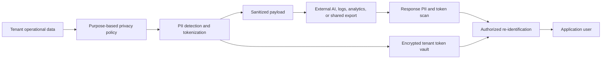

# Organization Data Anonymization Design

> Status: design proposal only. This document does not implement or modify application code, configuration, or database schemas.

## 1. Objective

Add a tenant-aware privacy boundary that prevents personally identifiable information (PII) from being exposed unnecessarily to external AI providers, application logs, analytics systems, support diagnostics, and shared exports.

The pipeline should:

- Detect PII in structured fields and unstructured Arabic or English text.
- Replace PII with stable, tenant-scoped tokens such as `[CUSTOMER_A7K2]` or `[EMAIL_F91C]`.
- Preserve financial values, dates, account codes, totals, and record relationships.
- Re-identify tokens only when the business workflow requires it and the caller is authorized.
- Keep token mappings encrypted and isolated from AI agents and normal application queries.

## 2. Important terminology

Stable reversible tokens are **pseudonymization**, not complete anonymization. The data can still be restored using a protected mapping. True anonymization is irreversible and is more suitable for aggregated analytics or permanently shared datasets.

This project should support both modes:

- **Pseudonymization:** reversible tokens for AI-assisted operational workflows.
- **Anonymization:** irreversible removal, generalization, or aggregation for analytics and external sharing.

## 3. Proposed architecture

Introduce a backend `AnonymizationModule` containing these conceptual services:

| Component | Responsibility |
|---|---|
| `DataPrivacyPolicyService` | Decides what must be protected for each destination and purpose. |
| `PiiDetectionService` | Finds structured and free-text PII in Arabic and English. |
| `TenantTokenService` | Creates stable tokens scoped to an organization and purpose. |
| `PayloadSanitizerService` | Traverses objects and text and replaces detected values. |
| `ReidentificationService` | Restores permitted tokens after authorization checks. |
| `OutboundAiGateway` | Enforces sanitization before external AI or embedding requests. |
| `SafeLogger` | Redacts sensitive values from logs, traces, and errors. |
| `PrivacyAuditService` | Records privacy actions without recording the protected values. |



The privacy boundary must be enforced in backend services. Frontend masking alone is not a security control.

## 4. Integration points in Hesbtak.AI

### 4.1 Chat and LangGraph AI requests

The central outbound LLM client in `Back/src/modules/ai/langgraph/config/llm.config.ts` is the final enforcement point before requests reach Groq, OpenAI, Hugging Face, or another provider.

Recommended flow:

1. An AI agent builds its semantic request using the tenant context.
2. The payload sanitizer receives `organizationId`, the request purpose, and structured messages.
3. PII is tokenized before JSON serialization and network transmission.
4. The provider receives only the sanitized prompt.
5. The returned response is scanned for unexpected PII and valid tokens.
6. Tokens are restored only for an authorized user-facing operational response.

The low-level client should reject external requests that lack a tenant/privacy context when the payload may contain organization data. Agent-specific sanitization can improve accuracy, but the central gateway remains the mandatory safety net.

### 4.2 AI conversations

Questions and responses stored in tenant `ai_conversations` may contain names, emails, phones, invoice descriptions, or copied documents.

Recommended policy:

- Store the operational conversation only when product requirements require it.
- Encrypt sensitive conversation content at rest or store a sanitized version where re-identification is unnecessary.
- Never copy raw conversation text into telemetry or support logs.
- Apply retention and tenant deletion policies to both conversations and their token mappings.

### 4.3 Embeddings

`Back/src/modules/ai/embeddings/embedding-provider.ts` can send text to an external embedding provider.

- Tenant/user content must be sanitized before external embedding.
- Static product documentation and general accounting knowledge do not require tenant tokenization.
- If an embedding must later support searches for a real entity, store the sanitized source ID and resolve it inside the application rather than embedding the original PII.
- Avoid re-identifying retrieved chunks before sending them to another external model.

### 4.4 Invoice and expense document extraction

An uploaded invoice image or PDF can contain PII inside pixels. A text sanitizer cannot protect a raw image before an external vision provider reads it.

Two valid designs are available:

1. **Preferred privacy design:** perform OCR locally, sanitize extracted text, and send only sanitized text to the external LLM for interpretation.
2. **Controlled provider design:** send the original document only to an approved provider under explicit retention, training, regional-processing, and contractual policies.

If visual layout is necessary, a future image-redaction stage could identify and cover sensitive regions locally. This is more complex and must be tested separately. The product must not claim that text tokenization protects raw uploaded images.

### 4.5 Logs and AI traces

`Back/src/modules/ai/langgraph/trace.ts` should eventually use a safe logging layer rather than logging raw prompts, document text, provider responses, SQL evidence, or exception response bodies.

Allowed log information includes:

- Organization pseudonymous identifier or internal ID, according to log-access policy.
- Operation name, provider, model, duration, status, and token counts.
- Number and categories of PII detections.
- Correlation and request IDs.

Raw protected values and token-vault mappings must never enter logs. Error sanitization must also cover provider error bodies because providers can echo request content.

### 4.6 Reports, exports, and scheduled emails

`Back/src/modules/reports/reports.service.ts` and AI report attachment generation need purpose-specific behavior:

- **Authorized operational report:** retain original business data because it is the intended product output.
- **Shared or analytics export:** anonymize or pseudonymize based on the selected policy.
- **Scheduled report email:** preserve or anonymize according to the report configuration and recipient authorization; do not silently change existing accounting reports.
- **Training or demo dataset:** use irreversible anonymization and remove token mappings.

Exports should include privacy metadata such as policy name and generation time, but never the mapping key.

## 5. Data classification for the current tenant schema

### Direct identifiers

- Customer and vendor names.
- Email addresses and phone numbers.
- Postal addresses.
- Tax or government identifiers if present in notes or documents.
- Scheduled-report recipients.

### Sensitive free text

- Journal entry and journal line descriptions.
- Invoice, bill, expense, and payment descriptions, notes, and references.
- OCR extracted text.
- AI conversation questions and responses.
- Generated report content, alerts, and suggestions.
- Filenames or attachment URLs containing personal names.

### Normally preserved accounting context

- Monetary values, quantities, tax rates, discounts, and totals.
- Transaction and due dates.
- Chart-of-account codes and accounting classifications.
- Currency codes and exchange rates.
- Internal record relationships and tenant-local IDs, unless the destination can misuse them.

Preservation is policy-dependent. Bank account and card numbers look numeric but are identifiers and must not be treated as ordinary financial amounts.

## 6. PII detection strategy

Detection should be layered from most reliable to least reliable:

1. **Schema-aware detection:** treat known fields such as `email`, `phone`, `address`, customer name, vendor name, and report recipient as PII without guessing.
2. **Tenant dictionary matching:** build a protected in-memory dictionary from the current tenant's customers and vendors so known entity names can be found in descriptions and conversations.
3. **Pattern detection:** detect emails, international and Egyptian phone formats, IBANs, payment cards, tax identifiers, and similar structured values.
4. **Language-aware entity detection:** identify people, organizations, and addresses in Arabic and English free text.
5. **Output validation:** rescan the sanitized payload to catch missed high-confidence patterns before transmission.

Arabic processing should normalize common letter variants, diacritics, Arabic/Latin digits, punctuation, whitespace, and bidirectional text for matching while preserving the original display value in the encrypted vault.

Detectors should return spans, categories, confidence, and source fields—not just modified strings. Overlapping matches must be resolved deterministically, preferring exact structured and tenant-dictionary matches.

## 7. Stable token design

Use opaque tokens rather than sequential tokens that reveal tenant counts:

```text
[CUSTOMER_A7K2]
[VENDOR_M3Q8]
[PERSON_P19F]
[EMAIL_E82D]
[PHONE_T4C1]
[ADDRESS_H77N]
[IBAN_B6K9]
```

Properties:

- Stable for the same normalized value within the same tenant and allowed purpose scope.
- Different across organizations, preventing cross-tenant correlation.
- Category-preserving so the AI model understands the role of a value.
- Opaque and non-sequential.
- Generated using a tenant-scoped keyed fingerprint or a vault lookup, never a plain unsalted hash.
- Exact enough to preserve relationships: repeated mentions of one customer receive the same token.

Purpose scope should be configurable. For example, the same customer may have one token across operational AI workflows but a different token in an exported analytics dataset.

## 8. Encrypted token vault

If reversibility is required, use a dedicated mapping store conceptually shaped as follows:

```text
pii_token_mappings
  id
  organization_id
  entity_type
  token
  value_ciphertext
  value_fingerprint
  purpose_scope
  key_version
  created_at
  last_used_at
  expires_at
```

Recommended controls:

- Store encrypted values only; never plaintext.
- Use envelope encryption with a managed key or a master key outside the database.
- Use a tenant-scoped HMAC fingerprint for deterministic lookup.
- Apply a unique constraint to tenant, category, purpose scope, and fingerprint.
- Make the vault accessible only through the privacy service and a dedicated database role.
- Audit lookup and re-identification events without recording plaintext.
- Support key rotation, expiry, tenant deletion, and legal retention requirements.

For this project, a protected central vault keyed by `organization_id` is preferable to adding mappings to each tenant schema. This keeps mappings away from tenant SQL agents and normal accounting queries. Strong row-level restrictions and service-only access would be mandatory. The mapping table must not be added to AI SQL query allowlists.

## 9. Purpose-based policy matrix

| Purpose | Protect PII | Re-identify result | Keep mapping | Notes |
|---|---:|---:|---:|---|
| External AI chat | Yes | Only for authorized final response | Yes, short/medium retention | Never expose vault to agent tools. |
| External embeddings | Yes | No | Usually yes for source resolution | Embed sanitized text. |
| External invoice vision | Raw document remains sensitive | N/A | N/A | Use local OCR or an approved provider policy. |
| Application logs | Yes | Never | No | Use irreversible redaction where possible. |
| Support diagnostics | Yes | Exceptional audited access only | Limited | Require explicit tenant/user authorization. |
| Internal operational export | According to user permissions | Not applicable | No new mapping required | Original data can be the intended output. |
| Shared export | Yes | Usually no | Optional | Clearly label as pseudonymized if reversible. |
| Analytics/training dataset | Yes, irreversible | Never | No | Generalize rare values and remove direct IDs. |

Policies must be selected by trusted server code, not by prompt text or model output.

## 10. Re-identification rules

Re-identification is a privileged operation:

1. Confirm the authenticated organization matches the token's organization.
2. Confirm the user has permission for the underlying workflow and record.
3. Accept only exact tokens generated by the service; never evaluate arbitrary placeholders.
4. Resolve only the tokens required for the current response.
5. Rescan the final output for unexpected PII or cross-tenant tokens.
6. Return the restored response to the application without logging it.

External providers, analytics pipelines, logs, and shared datasets must never receive re-identified output.

## 11. Proposed internal interfaces

The following TypeScript is illustrative only:

```ts
type PrivacyPurpose =
  | 'ai_chat'
  | 'ai_invoice_extraction'
  | 'external_embeddings'
  | 'application_logs'
  | 'support_diagnostics'
  | 'operational_export'
  | 'shared_export'
  | 'analytics_dataset';

interface PrivacyContext {
  organizationId: string;
  schemaName: string;
  userId?: string;
  purpose: PrivacyPurpose;
  correlationId: string;
}

interface SanitizationResult<T> {
  value: T;
  detectionsByType: Record<string, number>;
  containsReversibleTokens: boolean;
}

interface PayloadSanitizer {
  sanitize<T>(value: T, context: PrivacyContext): Promise<SanitizationResult<T>>;
}

interface ReidentificationService {
  restore(text: string, context: PrivacyContext): Promise<string>;
}
```

The API should accept structured objects so field context is preserved. Converting the entire request to one string before sanitizing would reduce accuracy and risk corrupting JSON, SQL, dates, and amounts.

## 12. Security requirements

- Deny external transmission when a sensitive workflow has no valid privacy context.
- Keep the token vault inaccessible to LLM tools, SQL agents, frontend clients, and general report queries.
- Ensure prompt injection cannot disable sanitization or request the mapping table.
- Produce different tokens for identical values in different organizations.
- Do not use encryption keys stored beside encrypted values in the same database configuration.
- Rate-limit and audit re-identification.
- Sanitize provider errors and network diagnostics.
- Delete mappings and derived sanitized artifacts according to tenant deletion and retention policy.
- Treat attachment URLs, object-storage paths, and filenames as possible PII.
- Review external providers for retention, training use, data region, subprocessors, and deletion guarantees.

## 13. Rollout plan

### Phase 1: Inventory and policy

- Confirm every external AI, embedding, logging, analytics, email, and export destination.
- Classify fields and define the purpose matrix.
- Decide which workflows require reversibility and retention.

### Phase 2: Detection in observation mode

- Run detectors without changing payloads.
- Record only detection counts and categories.
- Measure false positives and false negatives using synthetic Arabic and English fixtures.

### Phase 3: Logs and diagnostics

- Introduce safe structured logging.
- Remove raw prompts, OCR text, SQL evidence, responses, and provider error bodies from logs.

### Phase 4: External text AI

- Add tenant-scoped tokenization to the outbound LLM gateway.
- Add authorized restoration for final operational responses.
- Enforce privacy context at the network boundary.

### Phase 5: Embeddings and retrieval

- Separate static knowledge from tenant content.
- Sanitize external embeddings and verify retrieval remains useful.

### Phase 6: Invoice documents

- Choose local OCR or formally approve the external raw-document processing policy.
- Add image/PDF redaction only if business accuracy requires remote visual processing.

### Phase 7: Exports and analytics

- Add explicit anonymized/shared export modes.
- Build irreversible analytics datasets with privacy checks for rare or identifying combinations.

### Phase 8: Enforcement and audit

- Block noncompliant outbound requests.
- Add privacy dashboards containing counts and failures only.
- Perform tenant-isolation and adversarial prompt testing.

## 14. Test strategy

### Unit tests

- Detect Arabic and English names, emails, phones, addresses, IBANs, and mixed-script text.
- Preserve money, percentages, dates, currencies, account codes, and arithmetic.
- Produce the same token for repeated values in one tenant.
- Produce different tokens for the same value across tenants and configured purpose scopes.
- Resolve overlapping detections consistently.
- Verify encryption, key versioning, expiry, and token parsing.

### Integration tests

- Intercept every external LLM and embedding request and assert that seeded PII is absent.
- Assert raw prompts and provider error echoes never appear in logs.
- Verify final restoration succeeds only for the correct tenant and authorized user.
- Verify SQL/AI tools cannot query the token vault.
- Verify authorized operational reports remain correct.
- Verify shared exports contain no direct identifiers.
- Verify raw invoice files are not described as protected when sent to a vision provider.

### Adversarial tests

- Prompt instructions asking the model or tool to reveal mappings.
- Cross-tenant tokens inserted into user input.
- Token-like text written naturally by a user.
- Encoded or obfuscated emails and phone numbers.
- Arabic/Latin digit mixing and right-to-left control characters.
- PII inside nested JSON, arrays, filenames, URLs, and exception messages.

## 15. Privacy-safe observability

Collect metrics such as:

- Sanitized request count by purpose and provider.
- Detection count by PII category.
- Blocked outbound request count.
- Re-identification success and denial counts.
- Detector latency and payload size.
- Token-vault lookup and encryption failures.

Never attach raw values, sanitized payload bodies, token mappings, or user prompts to metrics.

## 16. Acceptance criteria

- All external AI and embedding traffic passes through one enforceable privacy boundary.
- Seeded direct identifiers do not appear in captured external text payloads.
- Financial amounts, dates, account classifications, and relationships remain accurate after sanitization.
- The same entity is represented consistently within an approved scope.
- Cross-tenant token correlation and re-identification fail.
- Logs and traces contain no raw seeded PII.
- Re-identification requires tenant context, user authorization, and an auditable purpose.
- The token vault is excluded from SQL-agent and reporting access.
- Raw-document limitations are documented and enforced by provider policy or local OCR.
- Tenant deletion removes or renders inaccessible all related mappings and derived artifacts.

## 17. Decisions required before implementation

1. Which workflows require reversible pseudonymization rather than irreversible anonymization?
2. Should tokens remain stable across all operational AI features or differ by purpose?
3. What is the retention period for AI conversations and token mappings?
4. Which key-management system will protect the token vault?
5. Can invoice OCR run locally, or must an external vision provider receive raw documents?
6. Which external providers have acceptable retention and training policies?
7. Should shared report anonymization be user-selectable, administrator-controlled, or both?
8. Which roles may re-identify AI responses and access support diagnostics?
9. Are attachment files encrypted with tenant-specific keys and included in tenant deletion?
10. What accuracy threshold blocks an outbound request versus allowing it with a warning?

## 18. Recommended first implementation slice

After the above decisions are approved, the safest first slice would be safe logging plus sanitization of text-only outbound AI requests. It has a clear network boundary, provides immediate privacy value, and can be verified with intercepted requests before changing OCR, exports, or analytics.

No implementation was performed as part of this document.
